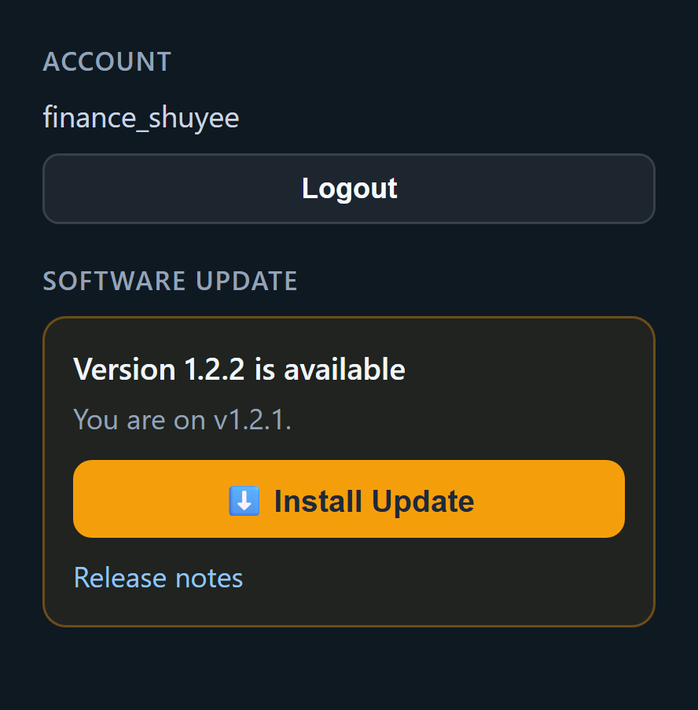

# Commission Portal — Install & Update

A short guide for everyone using the Commission Portal (Windows & macOS).
You install it **once**. After that it keeps itself up to date.

*(Once it is running, see [Using the Commission Portal](using-the-portal.md).)*

---

## Part 1 — Installing

Set aside about 5 minutes. There is nothing to install beforehand — the Portal
brings everything it needs with it.

### Step 1 — Download the Portal

Go to the **[Commission Portal download page](https://github.com/NurulAqilahSaifulBahril/Commission/releases/latest)**
and scroll down to the **Assets** list.

**Windows users:** Click **`CommissionDashboard-Setup-….exe`**

**Mac users:** Click **`CommissionDashboard-Setup-…-macos.zip`**

### Step 2 — Install

**Windows:**
1. Open the `.exe` file you just downloaded.
2. **If Windows shows a blue "Windows protected your PC" box:** click
   **More info**, then **Run anyway**. This is normal.
3. Click **Next** through the screens. Tick **Create a desktop shortcut** if you
   would like one.
4. Click **Install**.

**Mac:**
1. Open the `.zip` file you just downloaded (usually auto-extracts).
2. Drag **Commission Portal.app** to your **Applications** folder.
3. Open **Applications** and find **Commission Portal**, then double-click it to launch.

### Step 3 — Create your login

A window opens and asks you to create an account. Type a
**username** and a **password** and press Enter. Write them down — this is how
you log in.

### Step 4 — Add your access keys

The Portal needs keys to reach the company data. **Ask IT for your access keys** —
they will send you a few lines of text that look like `SOMETHING=a-long-code`.

**Windows:**
1. The Portal's folder is called **Commission Dashboard** (look in your Start Menu or the installer told you where).
2. Find the file **`.env`** and open it with Notepad (right-click → **Open with** → **Notepad**).
3. Go to the end and paste IT's lines, each on its own line.
4. Save (**Ctrl+S**) and close.

**Mac:**
1. Open **Finder** and go to **Applications**.
2. Right-click **Commission Portal.app** → **Show Package Contents**.
3. Navigate to `Contents/Resources/` and find the **Commission Dashboard** folder.
4. Open **`.env`** with any text editor (right-click → **Open With** → **TextEdit**).
5. Go to the end and paste IT's lines, each on its own line.
6. Save and close.

> Keep these keys private. Do not email them or send them in a chat message.

### Step 5 — Open the Portal

**Windows:** Start Menu → Finance Commission Dashboard (or use the desktop shortcut)

**Mac:** Applications → Commission Portal

Log in with the username and password from Step 3. The first load takes a moment
while it fetches the year's data. **You are done.**

---

## Part 2 — Updating

**Short version: you don't have to do anything.** The Portal checks for new
versions by itself and tells you when one is ready.

### When an update is ready

A **Software Update** box appears at the **bottom of the left-hand menu**,
showing the new version number.

**If you see an "Install Update" button:**

1. Click **Install Update**.
2. Click **OK** on the confirmation message.
3. Wait. A progress bar runs, the Portal restarts itself, and the page reloads
   on its own. This takes a minute or two.
4. **Do not close the window while it is working.**

**If you do not see a button**, the box says *"Ask an admin to install it."* —
there is nothing for you to do. Let your admin know.

### Things worth knowing

- **Nothing of yours is lost.** Your login, your access key, your Excel files,
  saved reports and any rates you edited all stay exactly as they are. An update
  only replaces the program itself.
- **You never download the installer again.** Steps 1–5 above are one time only.
- **To check your version:** look at the bottom-left corner of the menu.
- **If an update fails**, the Portal puts the old version back by itself and
  keeps working. Tell IT so they can look into it.

---

## If something goes wrong

| What you see | What to do |
|---|---|
| "Token expired" | Ask IT for a new access key, then redo Step 4 |
| The Portal will not open | Tell IT — ask them to check `dashboard.log` in the Portal's folder |
| An update failed | Tell IT — ask them to check `dashboard.log` |
| Numbers look out of date | Wait a few minutes, or click **Sync Data** at the top right |
