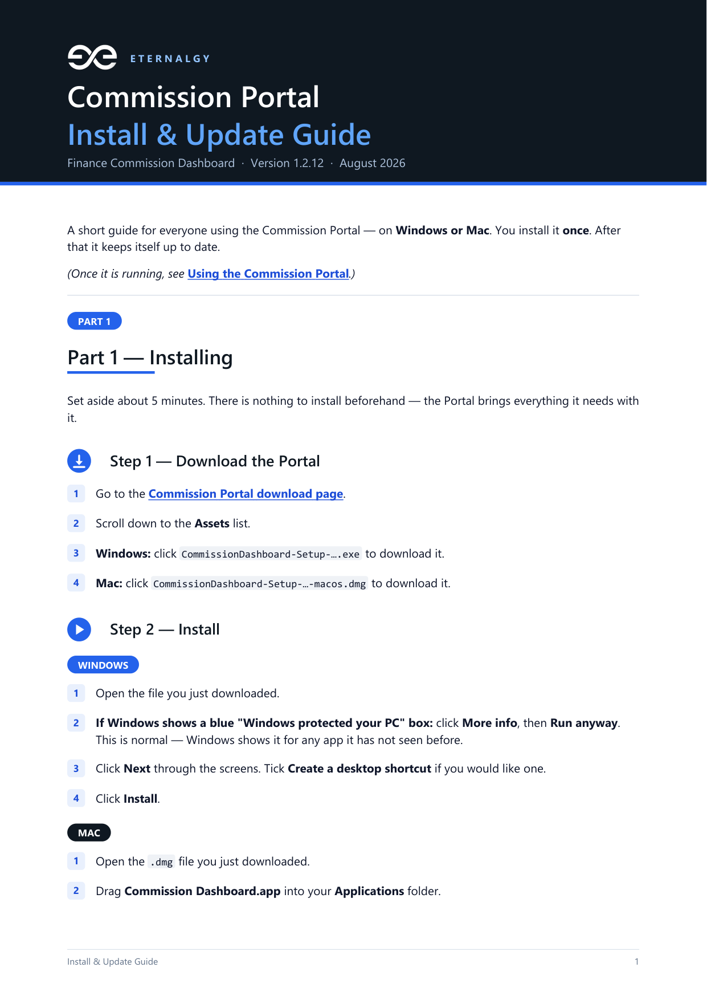

# Commission — Finance Commission Dashboard

## ⬇️ Download

### **[Download the latest release →](https://github.com/NurulAqilahSaifulBahril/Commission/releases/latest)**

[](https://github.com/NurulAqilahSaifulBahril/Commission/releases/latest)
[](https://github.com/NurulAqilahSaifulBahril/Commission/releases/latest)

On that page, grab **`CommissionDashboard-Setup-<version>.exe`** and run it.
**No prerequisites** — the installer bundles its own Python runtime with the
dependencies already installed, so nothing needs to be on the machine first.

## 📖 User guide

📖 **[Install & Update](docs/install-and-update.md)** — step by step, written for non-technical users.
📖 **[Using the Portal](docs/using-the-portal.md)** — reading the reports, filters, special cases, the Data page.
📄 **[Install & Update as a PDF](docs/Commission-Portal-User-Guide.pdf)** — printable, and attached to every release.

<a href="docs/Commission-Portal-User-Guide.pdf">
  
</a>

<sup>The thumbnail is decoration — the links above it are the ones that matter.</sup>

You only ever run the installer once; after that the dashboard updates itself from
GitHub Releases and an admin installs the update from the sidebar. Nothing of yours
is touched by an update — database, `.env`, workbooks, reports and edited rules all
survive. A failed update rolls back automatically and logs the reason to
`8. Web Dashboard\dashboard.log`.

### Cutting a release (maintainers)

```bash
git tag v1.2.0 && git push origin v1.2.0
```

That triggers [`.github/workflows/release.yml`](.github/workflows/release.yml), which builds the installer and the OTA package and publishes them to a new GitHub Release. Every installed dashboard picks it up within the hour.

To build locally instead:

```bash
python tools/build_package.py --version 1.2.0
```

---

## Running from source

**Folder:** `C:\Users\User\OneDrive\Documents\Commission`

Token is stored in `.env` files (same as running each report alone). You do **not** need `$env:PG_PROXY_TOKEN` each time.

## Individual reports

```powershell
cd "C:\Users\User\OneDrive\Documents\Commission\1. Basic Commission\3. Python Script"
python full_internal_basic_commission.py

cd "C:\Users\User\OneDrive\Documents\Commission\3. ANP Commission\3. Python Script"
python anp_commission.py
REM Default: full-year invoice-year-2026 (same data as finance Excel/PDF ANP sheet)

cd "C:\Users\User\OneDrive\Documents\Commission\2. NFP Commission\3. Python script"
python nfp_commission.py
REM Do not run anp_commission.py from the NFP folder — that file is not there.

cd "C:\Users\User\OneDrive\Documents\Commission\2. NFP Commission\3. Python script"
python nfp_commission.py
```

## Finance pack (Basic + ANP + NFP)

```powershell
cd C:\Users\User\OneDrive\Documents\Commission
python build_finance_commission_pack.py --year 2026
```

| Output | Command |
|--------|---------|
| Excel only | `python build_finance_commission_pack.py --year 2026` or `run_finance_pack.bat` |
| PDF only (finance summary) | `python build_finance_commission_pack.py --year 2026 --pdf` or `run_finance_pdf.bat` |
| Excel + PDF | `python build_finance_commission_pack.py --year 2026 --both` or `run_finance_both.bat` |

Files save to `Finance Output\Commission_Pack_2026_<timestamp>.xlsx` / `.pdf`

PDF layout (presentation for finance):
- Cover page with KPI totals
- Dashboard with pie chart (Basic/ANP/NFP mix) and bar chart (top 3 earners)
- One page per table (summary, each agent table, each invoice detail)

## Token (one-time / when expired)

Keep `PG_PROXY_TOKEN` in any of these (already set up):

- `3. ANP Commission\3. Python Script\.env`
- `1. Basic Commission\3. Python Script\.env`
- `2. NFP Commission\4. data\pg_proxy_token.txt`

Get a new JWT from your Postgres proxy admin when you see **Token expired**.

## GitHub

```powershell
.\push_to_github.ps1
```

(If you add it; otherwise use `git` from this folder.)
